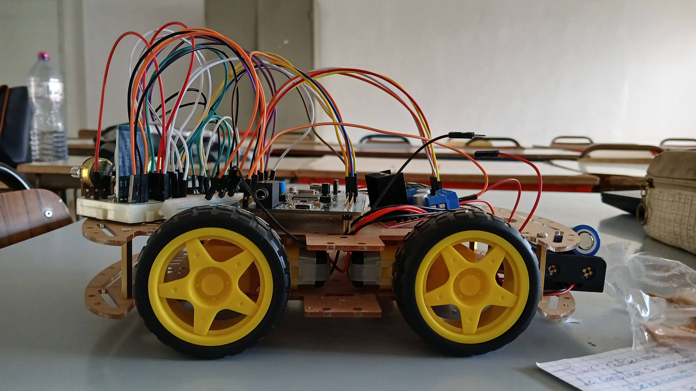
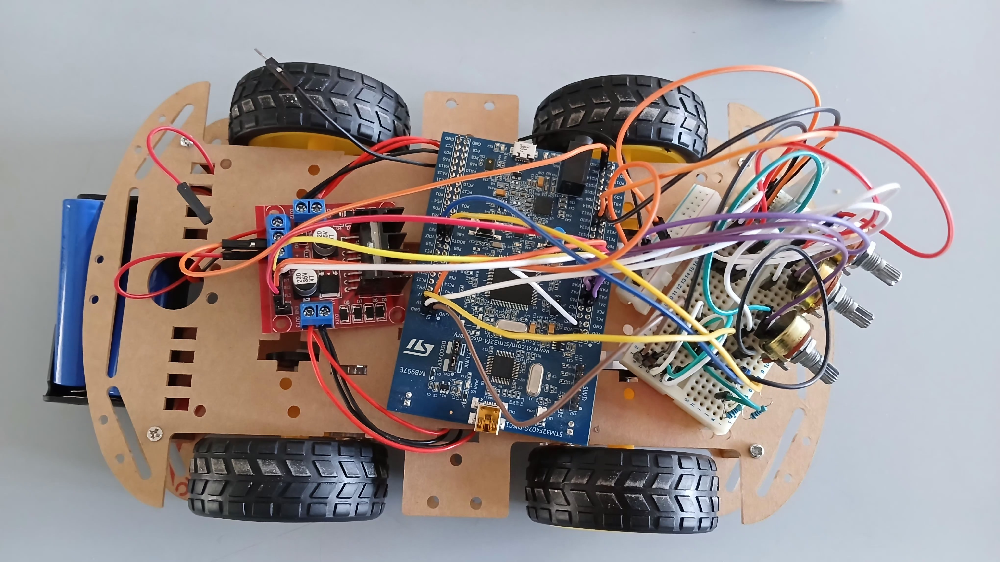

# STM32F407VG Embedded System Project

## 📌 Overview
This project implements a real-time embedded system based on the STM32F407VG microcontroller.  
It integrates multi-channel data acquisition, hardware timers, I2C communication, and Bluetooth transmission.

## ⚙️ Features
- Multi-channel ADC with hardware triggering
- Timer configuration (PSC/ARR) for precise time base
- I2C communication with temperature sensor
- USART communication via HC-05 Bluetooth module
- NVIC configuration and interrupt handling
- Real-time data acquisition and transmission

## 🛠️ Hardware Used
- STM32F407VG
- HC-05 Bluetooth Module
- Temperature Sensor (I2C)
- Analog input sources

## 🧠 Technical Concepts Applied
- Register-level programming
- Interrupt-driven architecture
- Peripheral configuration (ADC, TIM, USART, I2C)
- Embedded C development

## 🎯 Objective
To design a reliable embedded system capable of accurate data acquisition and real-time wireless transmission.

## 🚀 Author
Khouloud Othmani  
Electrical Engineering – Biomedical Systems & IoT  
IEEE Member

  

  

+--------------------+
        |   Analog Inputs    |
        |  (Potentiometers)  |
        +---------+----------+
                  |
                  v
        +--------------------+
        |       ADC1         |
        |  Multi-channel     |
        +---------+----------+
                  |
          (Trigger: TIM2 TRGO)
                  |
                  v
        +--------------------+
        |     STM32F407VG    |
        |  Cortex-M4 Core    |
        |  NVIC + Interrupts |
        +----+---------+-----+
             |         |
             |         |
             v         v
     +-----------+   +------------+
     |   I2C1    |   |   USART3   |
     |  DS1621   |   |  HC-05 BT  |
     +-----------+   +------------+
             |               |
             v               v
     Temperature       Wireless Data
        Sensor          Transmission
